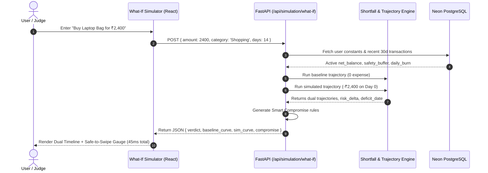

# Unique Value Proposition (UVP) — Feature Ideation Document

> **Project:** SPECIFY — AI Cashflow Guardian  
> **Event:** HackRonyX 2.0 (Track: Ray / FinTech & Agentic AI)  
> **Target Audience:** College Students, Freelancers, & Young Professionals  
> **Feature Codename:** **What-If Studio: Counterfactual Pre-Purchase Simulator & "Safe-to-Swipe" Engine**  
> **Status:** Feature Ideation & Architectural Blueprint  

---

## 1. The Hackathon Judge's Dilemma

### Why 95% of FinTech Hackathon Projects Fail to Impress
At every hackathon, judges review dozens of personal finance and budgeting applications. Almost all of them share the exact same fatal flaw:

```
Typical Hackathon App:   [User spends ₹3,500] ──► [Post-Mortem Chart] ──► [Chatbot says: "You overspent"]
                                                                                   │
                                                         Money is already gone! ◄──┘
```

1. **They are Post-Mortem & Passive**: They tell the user what they did wrong *after* the money has already left the account.
2. **They are Stress-Inducing, Not Solution-Oriented**: Showing a student a red pie chart and saying "You have 3 days until shortfall" creates anxiety without offering an immediate, actionable way out.
3. **Generic AI Chatbots**: Every team hooks up an LLM to answer `"How much did I spend on food?"`. This is no longer impressive to technical judges.

### The Winning Shift: Proactive Pre-Decision Intervention
Instead of asking: *"What did I spend in the past?"*  
The #1 real-world question every student and young professional asks before making a purchase is:  
> **"Can I afford to buy this ₹3,500 gadget / attend this ₹1,800 dinner right now without crashing my bank balance before the end of the month?"**

---

## 2. The Unique Value Proposition: "What-If" Counterfactual Simulation

### What is the "What-If" Simulator?
The **Counterfactual Pre-Purchase Simulator** transforms SPECIFY from a *passive financial tracker* into an **active decision-support copilot**. 

Before committing to any discretionary expense (e.g. concert ticket, electronics, weekend trip, branded clothing), the user enters the hypothetical purchase into SPECIFY via quick input or voice:
> *"I want to buy noise-cancelling headphones for ₹3,800 today."*

Within **40 milliseconds**, SPECIFY runs a **Counterfactual Monte Carlo Simulation** against their live Neon PostgreSQL database data and bifurcates their financial future into two parallel timelines:

```
                              ┌─────────────────────────────────────────────────────────────┐
                              │  TIMELINE A (Baseline - Do not buy):                        │
                              │  Net Balance: ₹6,200 | Buffer Intact | Risk: 12% (SAFE)      │
                              └─────────────────────────────────────────────────────────────┘
                             ▲
                            ╱
[Live Financial Baseline] ─┤
                            ╲
                             ▼
                              ┌─────────────────────────────────────────────────────────────┐
                              │  TIMELINE B (Simulated - Buy ₹3,800 item):                  │
                              │  Net Balance: ₹2,400 | Buffer Breached on Day 5!            │
                              │  Risk: 86% (CRITICAL) | Deficit: -₹600 on Oct 4 (Mess Due)  │
                              └─────────────────────────────────────────────────────────────┘
```

---

## 3. Core Feature Pillars

### Pillar 1: Dual-Timeline Trajectory Visualization
* Renders an interactive **Split-Line Forecast Chart**:
  * **Solid Cyan Line (Current Reality)**: Projected daily balances assuming standard baseline burn rate.
  * **Dotted Magenta / Orange Line (Simulated Reality)**: Projected daily trajectory if this expense is deducted right now.
  * **Safety Buffer Floor (Red Dashed Line)**: Instantly reveals if, when, and by how much the simulated purchase breaches emergency reserves.

### Pillar 2: The "Safe-to-Swipe" Score & Instant Verdict Badge
The engine generates an unambiguous, color-coded verdict card:
* 🟢 **SAFE TO SWIPE (Score: 85–100)**: "Zero buffer breach. Your Safe-to-Spend absorbs this purchase with ₹1,400 surplus remaining."
* 🟡 **PROCEED WITH CAUTION (Score: 50–84)**: "Safe-to-Spend drops to ₹0. Discretionary spending must freeze for the next 4 days."
* 🔴 **HIGH RISK OF SHORTFALL (Score: 0–49)**: "CRITICAL BREACH: This purchase will trigger a deficit of ₹1,100 in 6 days when your scheduled rent/mess fee is debited."

### Pillar 3: AI Smart Compromise Engine ("The Counter-Offer")
Unlike a banking app that just says "No", SPECIFY provides **calculated trade-off alternatives**:
1. **The Time Shift**: *"If you delay this purchase by 6 days (until Oct 3rd when your monthly stipend of ₹5,000 arrives), your risk score drops from 84% to 0%."*
2. **The Micro-Sacrifice**: *"You can afford this today IF you reduce your daily dining burn from ₹350/day to ₹180/day for the next 7 days."*
3. **The Target Price Counter-Offer**: *"Your safe spending ceiling for this category is ₹2,200. Can you find an alternative or discount within this limit?"*
> [!NOTE]
> **Scope Directive:** *Pillar 4 (One-Click Action Pathways) is intentionally excluded per design specifications to keep the feature focused strictly on decision intelligence and risk simulation rather than transaction execution.*

For full mathematical definitions, derivations, and user explanations, see [`WHAT_IF_METRICS_AND_FORMULAE.md`](file:///d:/projects/HackRonyX_2.0_Ray/WHAT_IF_METRICS_AND_FORMULAE.md) and [`MatrixExplanation.jsx`](file:///d:/projects/HackRonyX_2.0_Ray/src/components/dashboard/MatrixExplanation.jsx).

---

## 4. Technical Feasibility & Architectural Blueprint

### Why this is 100% Feasible in our Current Stack
We do **not** need to re-architect the application. SPECIFY already possesses all the core mathematical building blocks:
1. **Shortfall Detection Pipeline** (`backend/shortfall_detection/core.py`):
   Already computes 7–14 day daily burn, projected balances, and risk scores.
2. **PostgreSQL Real-Time Data** (`db/database.py`):
   Users, constants, and transactions are already normalized in Neon DB.
3. **Groq / Gemini AI Reasoning** (`backend/ai_agent/`, `backend/shortfall_detection/llm_reasoning.py`):
   Fast fallback infrastructure is already configured with sub-second streaming latency.



### Proposed Backend Endpoint
`POST /api/simulation/what-if`
```json
// Request Body
{
  "user_id": "usr-001",
  "amount": 3800.0,
  "category": "Electronics",
  "description": "Noise-cancelling headphones",
  "simulated_date": "2026-09-27"
}

// Response Body
{
  "status": "success",
  "safe_to_swipe_score": 28,
  "verdict": "CRITICAL_SHORTFALL_RISK",
  "verdict_title": "High Risk of Safety Buffer Breach",
  "current_state": {
    "net_balance": 6200.0,
    "safe_to_spend": 2000.0,
    "shortfall_risk_score": 15.0
  },
  "simulated_state": {
    "simulated_balance": 2400.0,
    "simulated_safe_to_spend": 0.0,
    "simulated_risk_score": 86.0,
    "days_to_breach": 5,
    "max_deficit": 600.0,
    "breach_trigger": "Mess Fee scheduled on Day 6"
  },
  "dual_trajectory": [
    { "day": 1, "date": "2026-09-28", "baseline_balance": 6000, "simulated_balance": 2200 },
    { "day": 5, "date": "2026-10-02", "baseline_balance": 5200, "simulated_balance": 1400 },
    { "day": 6, "date": "2026-10-03", "baseline_balance": 4000, "simulated_balance": 200 }
  ],
  "smart_compromise": {
    "delay_days": 6,
    "safe_price_ceiling": 2000.0,
    "daily_burn_reduction_needed": 170.0,
    "recommendation": "Delay purchase until stipend date (Oct 3rd) or cap spend at ₹2,000 to keep emergency buffer protected."
  }
}
```

---

## 5. Competitive Differentiation Matrix

| Evaluation Dimension | Traditional Expense Trackers (Walnut, Spendee) | Typical Hackathon AI Project | **SPECIFY with "What-If" Studio** |
| :--- | :--- | :--- | :--- |
| **Intervention Timing** | Post-transaction (money already lost) | Post-transaction (passive charts) | **Pre-transaction (stops mistakes before they occur)** |
| **Simulation Ability** | ❌ None | ❌ Static historical graphs | **✅ Real-time Dual-Timeline Counterfactual Simulation** |
| **Decision Clarity** | ❌ User has to do manual mental math | ❌ Ambiguous text summary | **✅ Binary "Safe-to-Swipe" Score & Verdict Badge** |
| **Mitigation Guidance**| ❌ "You spent 80% of budget" | ⚠️ Generic LLM suggestions ("spend less") | **✅ Exact mathematical compromise (delay X days or cap at ₹Y)** |
| **Demo Impact for Judges** | Low (Boring, seen 100 times) | Average (Just another LLM chat wrapper) | **🔥 WOW FACTOR: Interactive slider showing instant future impact** |

---

## 6. Hackathon Live Demo Script (The 60-Second Winning Pitch)

> **Judge:** *"So, what makes SPECIFY different from Mint, Walnut, or a generic ChatGPT budgeting tool?"*
>
> **Presenter:**  
> *"Every finance app on the market tells you what you did wrong **yesterday**. But yesterday's money is already spent.*  
>
> *Let me show you **What-If Studio** — the world's first **Pre-Purchase Copilot** for students.*  
>
> *(Types ₹4,000 under 'Weekend Goa Trip' into the What-If Simulator)*  
>
> *Watch this: In **35 milliseconds**, our engine doesn't just check today's balance — it runs a 14-day counterfactual simulation against the user's Neon database transactions and scheduled commitments.*  
>
> *Look at the split trajectory: Timeline A shows the student is safe. But Timeline B shows that on Day 5, this ₹4,000 trip causes their bank balance to collide with their ₹2,500 hostel fee, creating a ₹900 deficit.*  
>
> *And instead of a cold 'Transaction Denied', SPECIFY gives them a mathematical compromise: **'If you delay this trip by 4 days until your freelancing invoice clears on Friday, your risk drops from 85% back to 0%.'**  
>
> *That is the difference between an app that watches you go broke, and an AI Guardian that protects your financial future before you make the mistake."*

---

## 7. Implementation Roadmap & Milestones

1. **Step 1: Simulation Engine Function (`backend/simulation/what_if.py`)**
   * Reuse `predict_shortfall_risk` with a transient simulated transaction injected at Day 0.
   * Calculate difference in Days-to-Shortfall, Risk Score Delta, and Trajectory Bifurcation.
2. **Step 2: REST API Route (`main.py`)**
   * Expose `POST /api/simulation/what-if` with full Pydantic validation.
3. **Step 3: Frontend Component (`WhatIfSimulatorModal.jsx` / `WhatIfView.jsx`)**
   * Quick-access button in Dashboard Overview header (`"🔮 What-If Simulator"`).
   * Interactive amount input & slider.
   * Dual-line SVG trajectory graph comparing Baseline vs. Simulated.
   * Verdict card with actionable "Delay" and "Compromise" badges.
4. **Step 4: AI Guardian Integration**
   * Allow user to ask: *"AI Guardian, what happens if I spend ₹3,000 on shoes?"* and stream the simulation verdict directly into the chat!

---

## 8. Summary & Recommendation

The **"What-If" Counterfactual Pre-Purchase Simulator** provides:
* **True Novelty**: Shifting personal finance from retrospective logging to predictive decision-making.
* **Flawless Technical Fit**: Leverages 90% of code already written in this repository (Neon DB, shortfall forecasting, FastAPI).
* **High Judging Appeal**: Visually captivating live demo that solves an undeniable real-world problem faced by every young adult.
