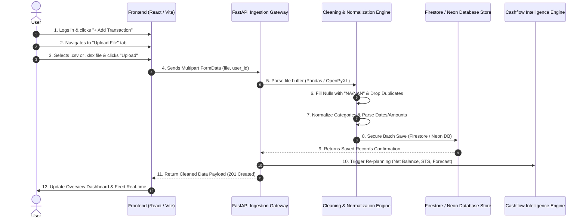

# CSV & Dataset Ingestion Pipeline — System Design & Logical Workflow

> **Project:** AI Cashflow Guardian  
> **Module:** Data Ingestion & Normalization Engine  
> **Document Status:** Architectural Specification & Detailed Workflow  
> **Output Target:** `csv_data_ingestion_pipeline.md`

---

## 1. Executive Summary & Component Overview

The **CSV & Dataset Ingestion Pipeline** forms the entry point of the **AI Cashflow Guardian** intelligence loop. In accordance with Section 6.1 (*High-Level Component View*) of the System Architecture, the ingestion pipeline transforms raw, heterogeneous bank statements, UPI export files, and `.csv`/`.xlsx` account feeds into normalized, cleaned, and auditable transaction records.

Once ingested, the pipeline automatically triggers downstream intelligence modules:
1. **Data Cleaning & Deduplication**
2. **Transaction Categorization**
3. **7–14 Day Liquidity Forecasting**
4. **Dynamic Safe-to-Spend (STS) Re-calculation**
5. **Shortfall Risk Detection**

```
┌─────────────────┐      ┌─────────────────────────┐      ┌─────────────────────────┐
│ Raw CSV / XLSX  │ ───► │  Ingestion & Cleaning   │ ───► │ Secure Database Store   │
│  User Upload    │      │  (Null Fill, De-dup)    │      │ (Firestore / Neon DB)   │
└─────────────────┘      └─────────────────────────┘      └─────────────────────────┘
                                                                       │
                                                                       ▼
                                                          ┌─────────────────────────┐
                                                          │ AI Intelligence Loop    │
                                                          │ (STS, Forecast, Risk)   │
                                                          └─────────────────────────┘
```

---

## 2. System Architecture & Component Interaction Flow

The diagram below illustrates the end-to-end flow from user interaction in the frontend dashboard to database storage and downstream financial engine re-planning.



---

## 3. Step-by-Step Ingestion & Cleaning Workflow

### Step 1: User Login & Session Verification
- The user authenticates via standard JWT / Firebase Authentication.
- Active session details (including `user_id`, e.g., `"usr-001"`) are stored in React component state.

### Step 2: Dashboard Modal Navigation
- The user opens the **"+ Add Transaction"** modal on the Liquidity Guardian Overview page.
- The user selects the **"Upload File (CSV / XLSX)"** tab alongside manual form entry and natural language text entry modes.

### Step 3: File Selection & Format Validation
- The frontend accepts file inputs with `.csv` or `.xlsx` extensions (MIME types: `text/csv`, `application/vnd.openxmlformats-officedocument.spreadsheetml.sheet`).
- Client-side validation verifies:
  - File size is within allowable limit (e.g., `<= 10 MB`).
  - Correct file extension.

### Step 4: Data Cleaning & Preprocessing Engine
Upon receiving the file at backend endpoint `POST /api/transactions/upload-csv`, the processing engine executes the following data quality passes:

1. **File Parsing**:
   - `.csv` files are parsed using `pandas.read_csv()`.
   - `.xlsx` files are parsed using `pandas.read_excel()` (via `openpyxl`).

2. **Null Value Handling**:
   - Missing or empty text fields (`description`, `category`, `payment_method`) are populated with **`"NA"`** or **`"NAN"`** defaults.
   - Missing numeric values (`amount`) are checked; rows with invalid amounts (`<= 0` or non-numeric) are logged as warnings or sanitized.
   - Missing timestamps default to the upload execution time.

3. **Deduplication Logic**:
   - Duplicate rows are detected using composite fingerprint hashing across `(transaction_date, amount, description, activity_type)`.
   - `df.drop_duplicates(subset=['transaction_date', 'amount', 'description'], keep='first')` ensures duplicate bank statement debits are not ingested twice.

4. **Category & Activity Normalization**:
   - Rule-based keyword matching classifies Indian payment patterns:
     - **Income**: `"Salary"`, `"Stipend"`, `"Freelance"`, `"Family Transfer"`, `"Refund"`.
     - **Expense**: `"Food & Beverages"`, `"Swiggy"`, `"Mess & Hostel"`, `"Rent"`, `"UPI Merchant"`, `"Academic"`.
   - `activity_type` is normalized to strictly `'income'` or `'expense'`.

### Step 5: Secure Storage & Database Ingestion
- Cleaned transaction records are prepared as a batch payload.
- Records are saved into **Firestore / Neon PostgreSQL** under the `transactions` collection/table.
- Raw uploaded files are archived in secure cloud storage (`gs://cashflow-guardian-imports/{user_id}/...`) with metadata tracing.

```sql
-- Schema matching Neon DB / Firestore target document structure
INSERT INTO transactions (
    transaction_id, user_id, activity_type, category, amount, description,
    transaction_date, transaction_time, payment_method, status, created_at
) VALUES (
    gen_random_uuid(), 'usr-001', 'expense', 'Food & Beverages', 350.00, 'Swiggy Order',
    '2026-09-26', '14:30:00', 'upi', 'Completed', CURRENT_TIMESTAMP
);
```

### Step 6: Triggering Downstream Intelligence & Re-planning
- After successful batch insertion:
  1. Recalculates Net Bank Balance ($B_t = \sum \text{Income} - \sum \text{Expenses}$).
  2. Recomputes **Dynamic Safe-to-Spend Today** ($STS = \text{Net Balance} - \text{Protected Commitments} - \text{Safety Buffer}$).
  3. Re-runs the **7–14 Day Liquidity Forecast Engine**.
  4. Evaluates **Shortfall Risk Detection**.

### Step 7: Real-Time Frontend Rendering & User Feedback
- API returns `201 Created` with a summary payload (`inserted_count`, `cleaned_rows`, `new_net_balance`, `new_safe_to_spend`).
- The frontend UI displays a success alert: **"Successfully imported X transactions from CSV!"**
- The dashboard auto-refreshes the **Recent Account Activity** feed, **Forecast Chart**, and **Hero Metrics**.

---

## 4. Technical Data Schema & API Contract

### API Endpoint Contract

```http
POST /api/transactions/upload-csv
Content-Type: multipart/form-data
```

#### Request Form Data
| Parameter Name | Type | Description |
| :--- | :--- | :--- |
| `file` | `File` (Binary) | The `.csv` or `.xlsx` file uploaded by user |
| `user_id` | `String` | Unique user identifier (e.g. `"usr-001"`) |

#### Successful Response Payload (`201 Created`)
```json
{
  "status": "success",
  "message": "Successfully processed and ingested CSV dataset!",
  "summary": {
    "total_rows_read": 25,
    "duplicates_removed": 2,
    "nulls_filled_count": 5,
    "valid_records_inserted": 23
  },
  "financial_updates": {
    "user_id": "usr-001",
    "new_net_balance": 8500.00,
    "new_safe_to_spend": 4300.00,
    "shortfall_risk": "SAFE"
  },
  "inserted_transactions": [
    {
      "transaction_id": "tx-csv-901",
      "user_id": "usr-001",
      "activity_type": "expense",
      "category": "Food & Beverages",
      "amount": 250.00,
      "description": "Canteen UPI",
      "transaction_date": "2026-09-26",
      "transaction_time": "12:30:00",
      "payment_method": "upi",
      "status": "Completed"
    }
  ]
}
```

---

## 5. Data Quality, Security & Error Handling Rules

1. **Graceful Handling of Malformed Files**:
   - If a CSV contains unparseable rows, the parser logs the line index, fills missing values with `"NA"`, and skips corrupted byte sequences without failing the entire batch.

2. **Security & Input Sanitization**:
   - Input filenames are sanitized to avoid path traversal attacks.
   - Text fields (`description`, `merchant`) are stripped of script tags or HTML entities.

3. **Determinism & Ground Truth**:
   - Numeric calculations strictly utilize Pandas / SQL aggregations. No LLM model owns numerical balances or transaction insertion.

4. **Auditability**:
   - Each batch insert logs a `trace_id` so judges or system administrators can audit the exact source file responsible for any balance update.
