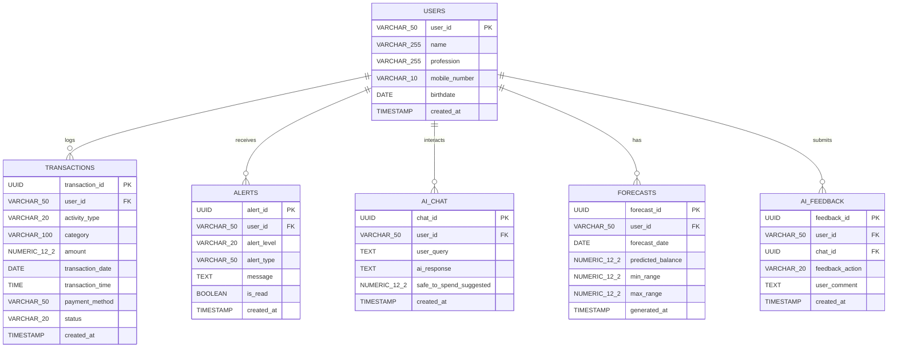

# SPECIFY Data Model Documentation

This document outlines the refined relational database schema designed for **SPECIFY** (stored on PostgreSQL via Neon.com).

---

## 1. System Architecture & Database Strategy

- **Firebase Firestore**: Stores user registration credentials & authentication mapping only.
- **PostgreSQL (Neon.com / `cashflow_db`)**: Acts as the primary relational datastore storing core service data including user personal information, financial transactions, real-time alerts, AI chat histories, liquidity forecasting, and recommendation feedback.
- **Shared Identifier**: `user_id` (`VARCHAR(50)`) serves as the immutable foreign key across all PostgreSQL tables, matching the Firebase Auth `uid` / `user_id`.



---

## 2. Table Specifications & Schema Definitions

### 2.1 Table: `users` (Personal Information)
Stores profile details associated with the user account authenticated via Firebase.

| Column Name | Data Type | Constraints | Description |
| :--- | :--- | :--- | :--- |
| `user_id` | `VARCHAR(50)` | `PRIMARY KEY` | Common User ID shared with Firebase Auth (e.g., `usr-001` or Firebase UID). |
| `name` | `VARCHAR(255)` | `NOT NULL` | Full name of the user. |
| `profession` | `VARCHAR(255)` | `NULLABLE` | User profession (e.g., Student, Freelancer, Salaried). |
| `mobile_number` | `VARCHAR(10)` | `NULLABLE` | 10-digit mobile phone number. |
| `birthdate` | `DATE` | `NULLABLE` | Date of birth. |
| `created_at` | `TIMESTAMP WITH TIME ZONE` | `DEFAULT CURRENT_TIMESTAMP` | Profile creation timestamp. |

#### DDL Query:
```sql
CREATE TABLE IF NOT EXISTS users (
    user_id VARCHAR(50) PRIMARY KEY,
    name VARCHAR(255) NOT NULL,
    profession VARCHAR(255),
    mobile_number VARCHAR(10),
    birthdate DATE,
    created_at TIMESTAMP WITH TIME ZONE DEFAULT CURRENT_TIMESTAMP
);
```

---

### 2.2 Table: `transactions` (Financial Ledger)
Tracks all individual income credits and expense debits with exact numeric precision and categories.

| Column Name | Data Type | Constraints | Description |
| :--- | :--- | :--- | :--- |
| `transaction_id` | `UUID` | `PRIMARY KEY, DEFAULT gen_random_uuid()` | Unique transaction ID. |
| `user_id` | `VARCHAR(50)` | `FOREIGN KEY REFERENCES users(user_id) ON DELETE CASCADE` | Associated user identifier. |
| `activity_type` | `VARCHAR(20)` | `NOT NULL, CHECK (activity_type IN ('income', 'expense'))` | Type of financial flow. |
| `category` | `VARCHAR(100)` | `NOT NULL` | Category (e.g., `food`, `stationary`, `stipend`, `salary`, `family_transfer`, `UPI Merchant`). |
| `amount` | `NUMERIC(12, 2)` | `NOT NULL, CHECK (amount >= 0)` | Transaction value (exact precision). |
| `description` | `TEXT` | `NULLABLE` | Optional transaction description or merchant name. |
| `transaction_date` | `DATE` | `NOT NULL, DEFAULT CURRENT_DATE` | Date of entry. |
| `transaction_time` | `TIME` | `NOT NULL, DEFAULT CURRENT_TIME` | HH:MM:SS time of entry. |
| `payment_method` | `VARCHAR(50)` | `NOT NULL` | Payment channel (`UPI`, `Credit`, `Debit`, `Cash`, `Cheque`). |
| `status` | `VARCHAR(20)` | `DEFAULT 'Completed'` | Status (`Completed`, `Protected`, `Scheduled`). |
| `created_at` | `TIMESTAMP WITH TIME ZONE` | `DEFAULT CURRENT_TIMESTAMP` | System record creation timestamp. |

#### DDL Query:
```sql
CREATE TABLE IF NOT EXISTS transactions (
    transaction_id UUID PRIMARY KEY DEFAULT gen_random_uuid(),
    user_id VARCHAR(50) NOT NULL REFERENCES users(user_id) ON DELETE CASCADE,
    activity_type VARCHAR(20) NOT NULL CHECK (activity_type IN ('income', 'expense')),
    category VARCHAR(100) NOT NULL,
    amount NUMERIC(12, 2) NOT NULL CHECK (amount >= 0),
    description TEXT,
    transaction_date DATE NOT NULL DEFAULT CURRENT_DATE,
    transaction_time TIME NOT NULL DEFAULT CURRENT_TIME,
    payment_method VARCHAR(50) NOT NULL,
    status VARCHAR(20) DEFAULT 'Completed',
    created_at TIMESTAMP WITH TIME ZONE DEFAULT CURRENT_TIMESTAMP
);

CREATE INDEX idx_transactions_user_date ON transactions(user_id, transaction_date DESC);
```

---

### 2.3 Table: `alerts` (Risk & Liquidity Notifications)
Stores system and AI-generated alerts regarding low balance risks, upcoming bill deadlines, and spending anomalies.

| Column Name | Data Type | Constraints | Description |
| :--- | :--- | :--- | :--- |
| `alert_id` | `UUID` | `PRIMARY KEY, DEFAULT gen_random_uuid()` | Unique alert identifier. |
| `user_id` | `VARCHAR(50)` | `FOREIGN KEY REFERENCES users(user_id) ON DELETE CASCADE` | Associated user. |
| `alert_level` | `VARCHAR(20)` | `NOT NULL, CHECK (alert_level IN ('low', 'mid', 'high', 'critical'))` | Risk severity level. |
| `alert_type` | `VARCHAR(50)` | `NOT NULL` | Category (`liquidity_risk`, `upcoming_bill`, `unusual_expense`). |
| `message` | `TEXT` | `NOT NULL` | Detailed alert text message. |
| `is_read` | `BOOLEAN` | `DEFAULT FALSE` | Read status flag. |
| `created_at` | `TIMESTAMP WITH TIME ZONE` | `DEFAULT CURRENT_TIMESTAMP` | Time alert was generated. |

#### DDL Query:
```sql
CREATE TABLE IF NOT EXISTS alerts (
    alert_id UUID PRIMARY KEY DEFAULT gen_random_uuid(),
    user_id VARCHAR(50) NOT NULL REFERENCES users(user_id) ON DELETE CASCADE,
    alert_level VARCHAR(20) NOT NULL CHECK (alert_level IN ('low', 'mid', 'high', 'critical')),
    alert_type VARCHAR(50) NOT NULL,
    message TEXT NOT NULL,
    is_read BOOLEAN DEFAULT FALSE,
    created_at TIMESTAMP WITH TIME ZONE DEFAULT CURRENT_TIMESTAMP
);

CREATE INDEX idx_alerts_user_read ON alerts(user_id, is_read);
```

---

### 2.4 Table: `ai_chat` (Conversational Safe-to-Spend Queries)
Stores conversations between the user and the SPECIFY assistant.

| Column Name | Data Type | Constraints | Description |
| :--- | :--- | :--- | :--- |
| `chat_id` | `UUID` | `PRIMARY KEY, DEFAULT gen_random_uuid()` | Unique chat interaction identifier. |
| `user_id` | `VARCHAR(50)` | `FOREIGN KEY REFERENCES users(user_id) ON DELETE CASCADE` | Associated user. |
| `user_query` | `TEXT` | `NOT NULL` | Natural language question asked by user. |
| `ai_response` | `TEXT` | `NOT NULL` | Generated response and financial advice. |
| `safe_to_spend_suggested` | `NUMERIC(12, 2)` | `NULLABLE` | Extracted numerical Safe-to-Spend recommendation if present. |
| `created_at` | `TIMESTAMP WITH TIME ZONE` | `DEFAULT CURRENT_TIMESTAMP` | Timestamp of conversation. |

#### DDL Query:
```sql
CREATE TABLE IF NOT EXISTS ai_chat (
    chat_id UUID PRIMARY KEY DEFAULT gen_random_uuid(),
    user_id VARCHAR(50) NOT NULL REFERENCES users(user_id) ON DELETE CASCADE,
    user_query TEXT NOT NULL,
    ai_response TEXT NOT NULL,
    safe_to_spend_suggested NUMERIC(12, 2),
    created_at TIMESTAMP WITH TIME ZONE DEFAULT CURRENT_TIMESTAMP
);

CREATE INDEX idx_ai_chat_user ON ai_chat(user_id, created_at DESC);
```

---

### 2.5 Table: `forecasts` (Liquidity & Safe-to-Spend Projections)
Stores 7-to-14 day forward-looking cashflow projections, expected balances, and confidence bounds.

| Column Name | Data Type | Constraints | Description |
| :--- | :--- | :--- | :--- |
| `forecast_id` | `UUID` | `PRIMARY KEY, DEFAULT gen_random_uuid()` | Unique forecast entry ID. |
| `user_id` | `VARCHAR(50)` | `FOREIGN KEY REFERENCES users(user_id) ON DELETE CASCADE` | Associated user. |
| `forecast_date` | `DATE` | `NOT NULL` | Target date in the future (e.g., `2026-05-20`). |
| `predicted_balance` | `NUMERIC(12, 2)` | `NOT NULL` | Forecasted net balance. |
| `min_range` | `NUMERIC(12, 2)` | `NOT NULL` | Worst-case balance boundary. |
| `max_range` | `NUMERIC(12, 2)` | `NOT NULL` | Best-case balance boundary. |
| `generated_at` | `TIMESTAMP WITH TIME ZONE` | `DEFAULT CURRENT_TIMESTAMP` | When the forecast model executed. |

#### DDL Query:
```sql
CREATE TABLE IF NOT EXISTS forecasts (
    forecast_id UUID PRIMARY KEY DEFAULT gen_random_uuid(),
    user_id VARCHAR(50) NOT NULL REFERENCES users(user_id) ON DELETE CASCADE,
    forecast_date DATE NOT NULL,
    predicted_balance NUMERIC(12, 2) NOT NULL,
    min_range NUMERIC(12, 2) NOT NULL,
    max_range NUMERIC(12, 2) NOT NULL,
    generated_at TIMESTAMP WITH TIME ZONE DEFAULT CURRENT_TIMESTAMP,
    CONSTRAINT unique_user_forecast_date UNIQUE (user_id, forecast_date)
);

CREATE INDEX idx_forecasts_user_date ON forecasts(user_id, forecast_date);
```

---

### 2.6 Table: `ai_feedback` (Reinforcement Learning Feedback)
Logs user feedback (Accept, Reject, Modify) on AI financial recommendations to improve future safe-to-spend estimations.

| Column Name | Data Type | Constraints | Description |
| :--- | :--- | :--- | :--- |
| `feedback_id` | `UUID` | `PRIMARY KEY, DEFAULT gen_random_uuid()` | Unique feedback entry ID. |
| `user_id` | `VARCHAR(50)` | `FOREIGN KEY REFERENCES users(user_id) ON DELETE CASCADE` | Associated user. |
| `chat_id` | `UUID` | `FOREIGN KEY REFERENCES ai_chat(chat_id) ON DELETE SET NULL` | Related AI chat interaction (optional). |
| `feedback_action` | `VARCHAR(20)` | `NOT NULL, CHECK (feedback_action IN ('accepted', 'rejected', 'modified'))` | User decision action. |
| `user_comment` | `TEXT` | `NULLABLE` | Optional qualitative feedback message. |
| `created_at` | `TIMESTAMP WITH TIME ZONE` | `DEFAULT CURRENT_TIMESTAMP` | Feedback submission time. |

#### DDL Query:
```sql
CREATE TABLE IF NOT EXISTS ai_feedback (
    feedback_id UUID PRIMARY KEY DEFAULT gen_random_uuid(),
    user_id VARCHAR(50) NOT NULL REFERENCES users(user_id) ON DELETE CASCADE,
    chat_id UUID REFERENCES ai_chat(chat_id) ON DELETE SET NULL,
    feedback_action VARCHAR(20) NOT NULL CHECK (feedback_action IN ('accepted', 'rejected', 'modified')),
    user_comment TEXT,
    created_at TIMESTAMP WITH TIME ZONE DEFAULT CURRENT_TIMESTAMP
);
```

---

## 3. Benefits of Refined Schema Design

1. **Numeric Precision**: Uses `NUMERIC(12, 2)` instead of raw single-precision floating point numbers to avoid rounding errors in financial transactions.
2. **Referential Integrity**: Implements `FOREIGN KEY ... ON DELETE CASCADE` bound to the common `user_id` identifier.
3. **Optimized Indexes**: Key queries (filtering transactions by user & date, fetching unread alerts, loading chat history) are indexed for fast response times.
4. **Data Integrity & Constraints**: Strict `CHECK` constraints prevent negative transaction amounts and enforce valid enum categories (`income`/`expense`, alert levels, feedback decisions).
