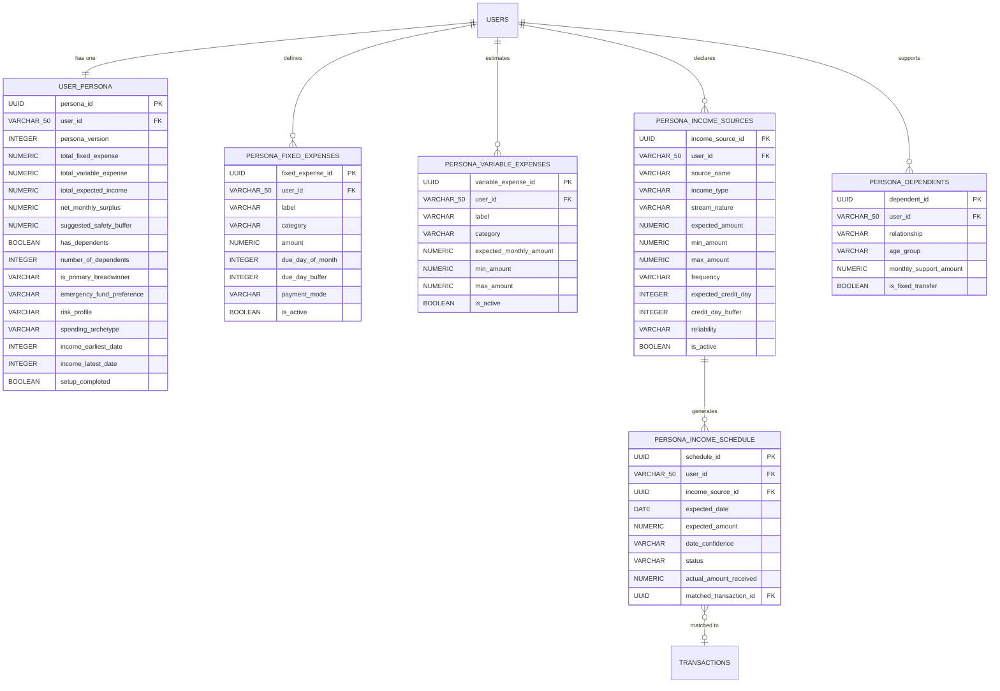

# Persona Creation Feature — Complete Plan & Database Schema

> **SPECIFY — Persona Engine**
> *"Know the person first. Then, and only then, protect their money."*

---

## 1. Why Persona Creation?

The entire intelligence loop of SPECIFY (`OBSERVE -> PREDICT -> EXPLAIN -> INTERVENE -> LEARN -> RE-PLAN`) fundamentally depends on **knowing who the user is** before a single transaction is analyzed. Without persona context:

- The Safe-to-Spend (STS) calculation has no baseline to protect.
- The forecasting engine cannot distinguish between recurring income vs. one-off transfers.
- The risk engine cannot know what counts as a *shortfall* (a student has very different thresholds vs. a salaried professional supporting a family).
- The recommendation engine cannot personalize advice.

**Persona Creation transforms SPECIFY from a generic tracker into a personalized financial co-pilot.**

---

## 2. Feature Overview

### What Is a "Persona"?

A Persona is a **structured financial fingerprint** of the user, collected once during onboarding (Profile Setup) and used by every downstream system. It captures:

| Dimension | Data Collected |
|---|---|
| **Fixed Commitments** | Recurring monthly expenses that are non-negotiable |
| **Variable Expectations** | Best-effort monthly expense estimates |
| **Income Sources** | All scheduled and irregular income streams |
| **Dependents & Obligations** | Family members financially reliant on the user |
| **Income Dates** | Tentative dates when income is expected each month |
| **Financial Personality** | Derived risk profile, spending archetype, buffer preference |

---

## 3. User Journey — The Persona Setup Flow

The Persona Creation is a **multi-step guided onboarding wizard** that appears immediately after signup. It is broken into 5 focused steps to avoid cognitive overload.

```
+----------------------------------------------------------+
|              SPECIFY — Persona Setup Wizard               |
|                                                          |
|  Step 1 --> Step 2 --> Step 3 --> Step 4 --> Step 5     |
|  Fixed     Variable   Income    Dependents  Review &    |
|  Expenses  Expenses   Sources   & Dates     Confirm     |
+----------------------------------------------------------+
```

---

### Step 1 — Fixed Expenses (Committed Money)

> *"What money goes out every single month no matter what?"*

These are **non-negotiable, recurring, predictable** expenses. The system will **always protect** this money in the STS calculation.

| Input Field | Type | Example |
|---|---|---|
| Rent / PG / Mess | Numeric (INR) | 12,000 |
| EMI — Home Loan | Numeric (INR) | 8,500 |
| EMI — Vehicle Loan | Numeric (INR) | 4,200 |
| EMI — Personal Loan | Numeric (INR) | 3,000 |
| Electricity Bill | Numeric (INR) | 800 |
| Internet / Broadband | Numeric (INR) | 699 |
| Mobile Recharge (Postpaid) | Numeric (INR) | 399 |
| Insurance Premium (Monthly) | Numeric (INR) | 1,500 |
| OTT Subscriptions (total) | Numeric (INR) | 549 |
| Gym / Fitness Membership | Numeric (INR) | 1,200 |
| Academic Fee (EMI) | Numeric (INR) | 2,000 |
| Other Fixed Expense (add more) | Dynamic list | User-defined |

**Key UX note:** User can add custom rows with a label and amount. Each entry has an optional "Expected Due Date" (day of month: 1-31).

---

### Step 2 — Variable Expected Expenses (Lifestyle Baseline)

> *"What do you typically spend on in a normal month?"*

These are **predictable-but-flexible** expenses. They form the baseline for the forecast's expected case vs. worst case.

| Input Field | Type | Example |
|---|---|---|
| Monthly Food Budget (groceries + dining) | Numeric (INR) | 4,500 |
| Personal Transport (Petrol/Diesel) | Numeric (INR) | 2,800 |
| Cab / Auto / Metro (daily commute) | Numeric (INR) | 1,500 |
| Weekend / Leisure Spending | Numeric (INR) | 2,000 |
| Clothing / Shopping | Numeric (INR) | 1,000 |
| Medical / Pharmacy | Numeric (INR) | 500 |
| Planned Trips / Travel (monthly amortised) | Numeric (INR) | 2,500 |
| Self-Development (books, courses) | Numeric (INR) | 500 |
| Other Variable (add more) | Dynamic list | User-defined |

**Key UX note:** Show a **real-time running total** and a **"Monthly Spend Estimate"** summary so the user can sanity-check before moving on.

---

### Step 3 — Income Sources (Money In)

> *"Where does your money come from, and when?"*

Capture all income streams — both **scheduled (recurring)** and **variable (irregular)**.

#### 3A — Scheduled / Recurring Income

| Field | Type | Example |
|---|---|---|
| Source Name | Text | "Company Salary", "College Stipend" |
| Income Type | Enum | Salary, Stipend, Pension, Fixed Transfer, Freelance Retainer |
| Amount (expected) | Numeric (INR) | 35,000 |
| Frequency | Enum | Monthly, Weekly, Bi-weekly, One-time |
| Expected Credit Date | Day of Month (1-31) + buffer | e.g., 1st of every month (+/- 2 day buffer) |
| Payment Mode | Enum | Bank Transfer, UPI, Cash, Cheque |
| Reliability | Enum | Always on time / Occasionally late / Irregular |

#### 3B — Variable / Irregular Income

| Field | Type | Example |
|---|---|---|
| Source Name | Text | "Freelance Design Projects" |
| Income Type | Enum | Freelance, Part-time, Commission, Family Transfer, Gifting |
| Typical Monthly Amount | Numeric (INR) | 8,000 |
| Frequency Pattern | Enum | 1-2 times/month, Quarterly, Random |
| Notes | Text | "Varies between 3,000-15,000" |

**Multiple income rows** can be added (e.g., a student with stipend + family transfer + part-time freelance).

---

### Step 4 — Dependents & Financial Obligations

> *"Is anyone financially dependent on you?"*

This is critical for understanding **real disposable income** and **safety buffer requirements**.

| Field | Type | Example |
|---|---|---|
| Has Dependents? | Boolean (Yes/No toggle) | Yes |
| Dependent Relationship | Enum (Multi-select) | Spouse, Children, Parents, Siblings, Other |
| Number of Dependents | Numeric | 2 |
| Monthly Send-Home / Family Support | Numeric (INR) | 8,000 |
| Is this a Fixed Monthly Transfer? | Boolean | Yes (goes to Fixed Expenses table) |
| Emergency Fund Preference | Enum | None / 1 month buffer / 2 months buffer / 3 months buffer |
| Are you the primary breadwinner? | Boolean | Yes / No / Shared |

---

### Step 5 — Review & Confirm

Show a **persona summary card** with all inputs, computed highlights:
- **Total Protected Monthly Commitments (Fixed)**
- **Total Expected Variable Spend**
- **Total Expected Monthly Income**
- **Net Monthly Surplus / Deficit estimate**
- **Suggested Safety Buffer** (auto-calculated)
- **Risk Profile Label** (Derived: Conservative / Balanced / Flexible)

User can **Edit any step** or **Confirm & Complete**.

---

## 4. System Intelligence From Persona Data

Once saved, the Persona drives every SPECIFY subsystem:

```
Persona Data
     |
     +---> STS Engine
     |        Protected money = SUM(fixed_expenses) + safety_buffer
     |        Safe-to-Spend = Projected Balance - Protected Money
     |
     +---> Forecasting Engine
     |        Expected Income: uses income_sources with expected_credit_date
     |        Expected Expenses: distributes variable_expenses across month
     |        Best/Worst Case: uses reliability flags on income sources
     |
     +---> Risk / Alert Engine
     |        Shortfall threshold tuned to: number_of_dependents, is_breadwinner
     |        Alert sensitivity: emergency_fund_preference
     |
     +---> Recommendation Engine
     |        Personalized advice tied to spending archetype
     |        "You typically spend 4,500 on food — this month you've crossed it"
     |
     +---> What-If Simulator
              Pre-fills baseline: "What if stipend is 3 days late?"
              Uses income reliability flag to simulate probability
```

---

## 5. Derived Fields (Computed, Not User-Input)

The backend computes these from raw persona inputs and stores them:

| Derived Field | Formula / Logic |
|---|---|
| `total_fixed_expense` | SUM of all fixed expense amounts |
| `total_variable_expense` | SUM of all variable expense amounts |
| `total_expected_income` | SUM of all income source amounts |
| `net_monthly_surplus` | total_expected_income - total_fixed_expense - total_variable_expense |
| `suggested_safety_buffer` | MAX(fixed_expenses * 0.2, 2000) or user-defined |
| `risk_profile` | Derived from surplus ratio + dependent count + reliability mix |
| `income_start_of_month` | Earliest expected income credit date |
| `income_end_of_month` | Latest expected income credit date |
| `spending_archetype` | Rule-based: 'Saver', 'Balanced', 'Free Spender' |

---

## 6. Complete Database Schema

### Architecture Note
All persona tables live in **PostgreSQL (Neon.com / `cashflow_db`)**, linked to the existing `users` table via `user_id` (Firebase Auth UID).

---

### 6.1 Table: `user_persona` (Master Persona Record)

One row per user. Stores the top-level persona metadata and all derived fields.

| Column | Type | Constraints | Description |
|---|---|---|---|
| `persona_id` | `UUID` | `PK, DEFAULT gen_random_uuid()` | Unique persona record ID |
| `user_id` | `VARCHAR(50)` | `FK -> users(user_id) ON DELETE CASCADE, UNIQUE` | One persona per user |
| `persona_version` | `INTEGER` | `DEFAULT 1` | Increments on each user re-edit |
| `total_fixed_expense` | `NUMERIC(12,2)` | `NOT NULL, DEFAULT 0` | Computed: sum of fixed items |
| `total_variable_expense` | `NUMERIC(12,2)` | `NOT NULL, DEFAULT 0` | Computed: sum of variable items |
| `total_expected_income` | `NUMERIC(12,2)` | `NOT NULL, DEFAULT 0` | Computed: sum of all income sources |
| `net_monthly_surplus` | `NUMERIC(12,2)` | `NULLABLE` | total_income - total_fixed - total_variable |
| `suggested_safety_buffer` | `NUMERIC(12,2)` | `NOT NULL, DEFAULT 2000` | System or user-set buffer |
| `user_safety_buffer_override` | `NUMERIC(12,2)` | `NULLABLE` | If user manually set a different buffer |
| `has_dependents` | `BOOLEAN` | `DEFAULT FALSE` | Any dependents? |
| `number_of_dependents` | `INTEGER` | `DEFAULT 0` | Count of dependents |
| `is_primary_breadwinner` | `VARCHAR(10)` | `DEFAULT 'no'` | 'yes' / 'no' / 'shared' |
| `emergency_fund_preference` | `VARCHAR(20)` | `DEFAULT 'none'` | 'none' / '1_month' / '2_months' / '3_months' |
| `risk_profile` | `VARCHAR(20)` | `NULLABLE` | Derived: 'conservative' / 'balanced' / 'flexible' |
| `spending_archetype` | `VARCHAR(30)` | `NULLABLE` | Derived: 'saver' / 'balanced' / 'free_spender' |
| `income_earliest_date` | `INTEGER` | `NULLABLE` | Day-of-month of first expected income |
| `income_latest_date` | `INTEGER` | `NULLABLE` | Day-of-month of last expected income |
| `setup_completed` | `BOOLEAN` | `DEFAULT FALSE` | Whether wizard was fully completed |
| `setup_step_reached` | `INTEGER` | `DEFAULT 1` | Last completed step (for resume on re-entry) |
| `created_at` | `TIMESTAMP WITH TIME ZONE` | `DEFAULT CURRENT_TIMESTAMP` | First persona creation |
| `updated_at` | `TIMESTAMP WITH TIME ZONE` | `DEFAULT CURRENT_TIMESTAMP` | Last persona update |

```sql
CREATE TABLE IF NOT EXISTS user_persona (
    persona_id UUID PRIMARY KEY DEFAULT gen_random_uuid(),
    user_id VARCHAR(50) NOT NULL UNIQUE REFERENCES users(user_id) ON DELETE CASCADE,
    persona_version INTEGER DEFAULT 1,
    total_fixed_expense NUMERIC(12,2) NOT NULL DEFAULT 0,
    total_variable_expense NUMERIC(12,2) NOT NULL DEFAULT 0,
    total_expected_income NUMERIC(12,2) NOT NULL DEFAULT 0,
    net_monthly_surplus NUMERIC(12,2),
    suggested_safety_buffer NUMERIC(12,2) NOT NULL DEFAULT 2000,
    user_safety_buffer_override NUMERIC(12,2),
    has_dependents BOOLEAN DEFAULT FALSE,
    number_of_dependents INTEGER DEFAULT 0,
    is_primary_breadwinner VARCHAR(10) DEFAULT 'no'
        CHECK (is_primary_breadwinner IN ('yes', 'no', 'shared')),
    emergency_fund_preference VARCHAR(20) DEFAULT 'none'
        CHECK (emergency_fund_preference IN ('none', '1_month', '2_months', '3_months')),
    risk_profile VARCHAR(20)
        CHECK (risk_profile IN ('conservative', 'balanced', 'flexible')),
    spending_archetype VARCHAR(30)
        CHECK (spending_archetype IN ('saver', 'balanced', 'free_spender')),
    income_earliest_date INTEGER CHECK (income_earliest_date BETWEEN 1 AND 31),
    income_latest_date INTEGER CHECK (income_latest_date BETWEEN 1 AND 31),
    setup_completed BOOLEAN DEFAULT FALSE,
    setup_step_reached INTEGER DEFAULT 1,
    created_at TIMESTAMP WITH TIME ZONE DEFAULT CURRENT_TIMESTAMP,
    updated_at TIMESTAMP WITH TIME ZONE DEFAULT CURRENT_TIMESTAMP
);

CREATE INDEX idx_persona_user ON user_persona(user_id);
```

---

### 6.2 Table: `persona_fixed_expenses` (Committed Monthly Outflows)

One row per fixed expense item. Multiple rows per user.

| Column | Type | Constraints | Description |
|---|---|---|---|
| `fixed_expense_id` | `UUID` | `PK, DEFAULT gen_random_uuid()` | Unique item ID |
| `user_id` | `VARCHAR(50)` | `FK -> users(user_id) ON DELETE CASCADE` | Owning user |
| `label` | `VARCHAR(100)` | `NOT NULL` | Name e.g. "Rent", "Netflix" |
| `category` | `VARCHAR(50)` | `NOT NULL` | 'rent' / 'emi' / 'utility' / 'subscription' / 'insurance' / 'academic' / 'family_support' / 'other' |
| `amount` | `NUMERIC(12,2)` | `NOT NULL, CHECK (amount >= 0)` | Monthly committed amount |
| `due_day_of_month` | `INTEGER` | `NULLABLE, CHECK (1..31)` | Expected due date (day) |
| `due_day_buffer` | `INTEGER` | `DEFAULT 0` | +/- buffer days for scheduling |
| `payment_mode` | `VARCHAR(30)` | `DEFAULT 'auto_debit'` | 'auto_debit' / 'upi' / 'net_banking' / 'cash' / 'cheque' |
| `is_active` | `BOOLEAN` | `DEFAULT TRUE` | Can be toggled off without deletion |
| `notes` | `TEXT` | `NULLABLE` | Optional user note |
| `created_at` | `TIMESTAMP WITH TIME ZONE` | `DEFAULT CURRENT_TIMESTAMP` | Record creation |

```sql
CREATE TABLE IF NOT EXISTS persona_fixed_expenses (
    fixed_expense_id UUID PRIMARY KEY DEFAULT gen_random_uuid(),
    user_id VARCHAR(50) NOT NULL REFERENCES users(user_id) ON DELETE CASCADE,
    label VARCHAR(100) NOT NULL,
    category VARCHAR(50) NOT NULL
        CHECK (category IN ('rent', 'emi', 'utility', 'subscription', 'insurance',
                            'academic', 'family_support', 'other')),
    amount NUMERIC(12,2) NOT NULL CHECK (amount >= 0),
    due_day_of_month INTEGER CHECK (due_day_of_month BETWEEN 1 AND 31),
    due_day_buffer INTEGER DEFAULT 0,
    payment_mode VARCHAR(30) DEFAULT 'auto_debit'
        CHECK (payment_mode IN ('auto_debit', 'upi', 'net_banking', 'cash', 'cheque')),
    is_active BOOLEAN DEFAULT TRUE,
    notes TEXT,
    created_at TIMESTAMP WITH TIME ZONE DEFAULT CURRENT_TIMESTAMP
);

CREATE INDEX idx_fixed_expenses_user ON persona_fixed_expenses(user_id, is_active);
```

---

### 6.3 Table: `persona_variable_expenses` (Expected Monthly Variable Spend)

Baseline variable spending estimates per category.

| Column | Type | Constraints | Description |
|---|---|---|---|
| `variable_expense_id` | `UUID` | `PK, DEFAULT gen_random_uuid()` | Unique item ID |
| `user_id` | `VARCHAR(50)` | `FK -> users(user_id) ON DELETE CASCADE` | Owning user |
| `label` | `VARCHAR(100)` | `NOT NULL` | e.g. "Food & Dining" |
| `category` | `VARCHAR(50)` | `NOT NULL` | 'food' / 'transport' / 'leisure' / 'shopping' / 'medical' / 'travel' / 'self_dev' / 'other' |
| `expected_monthly_amount` | `NUMERIC(12,2)` | `NOT NULL, CHECK (>= 0)` | Best estimate for the month |
| `min_amount` | `NUMERIC(12,2)` | `NULLABLE` | Minimum (tight month) |
| `max_amount` | `NUMERIC(12,2)` | `NULLABLE` | Maximum (indulgent month) |
| `is_active` | `BOOLEAN` | `DEFAULT TRUE` | Active flag |
| `notes` | `TEXT` | `NULLABLE` | Optional context |
| `created_at` | `TIMESTAMP WITH TIME ZONE` | `DEFAULT CURRENT_TIMESTAMP` | Record creation |

```sql
CREATE TABLE IF NOT EXISTS persona_variable_expenses (
    variable_expense_id UUID PRIMARY KEY DEFAULT gen_random_uuid(),
    user_id VARCHAR(50) NOT NULL REFERENCES users(user_id) ON DELETE CASCADE,
    label VARCHAR(100) NOT NULL,
    category VARCHAR(50) NOT NULL
        CHECK (category IN ('food', 'transport', 'leisure', 'shopping',
                            'medical', 'travel', 'self_dev', 'other')),
    expected_monthly_amount NUMERIC(12,2) NOT NULL CHECK (expected_monthly_amount >= 0),
    min_amount NUMERIC(12,2),
    max_amount NUMERIC(12,2),
    is_active BOOLEAN DEFAULT TRUE,
    notes TEXT,
    created_at TIMESTAMP WITH TIME ZONE DEFAULT CURRENT_TIMESTAMP
);

CREATE INDEX idx_variable_expenses_user ON persona_variable_expenses(user_id, is_active);
```

---

### 6.4 Table: `persona_income_sources` (All Income Streams)

One row per income stream. Handles both scheduled and irregular income.

| Column | Type | Constraints | Description |
|---|---|---|---|
| `income_source_id` | `UUID` | `PK, DEFAULT gen_random_uuid()` | Unique income item ID |
| `user_id` | `VARCHAR(50)` | `FK -> users(user_id) ON DELETE CASCADE` | Owning user |
| `source_name` | `VARCHAR(100)` | `NOT NULL` | e.g. "TCS Salary", "Dad's Transfer" |
| `income_type` | `VARCHAR(30)` | `NOT NULL` | 'salary' / 'stipend' / 'freelance' / 'family_transfer' / 'pension' / 'part_time' / 'commission' / 'business' / 'gift' / 'savings_withdrawal' / 'other' |
| `stream_nature` | `VARCHAR(20)` | `NOT NULL, DEFAULT 'scheduled'` | 'scheduled' (recurring) or 'variable' (irregular) |
| `expected_amount` | `NUMERIC(12,2)` | `NOT NULL, CHECK (>= 0)` | Expected credit per cycle |
| `min_amount` | `NUMERIC(12,2)` | `NULLABLE` | Worst-case low for variable income |
| `max_amount` | `NUMERIC(12,2)` | `NULLABLE` | Best-case high for variable income |
| `frequency` | `VARCHAR(20)` | `NOT NULL, DEFAULT 'monthly'` | 'monthly' / 'weekly' / 'biweekly' / 'quarterly' / 'one_time' / 'irregular' |
| `expected_credit_day` | `INTEGER` | `NULLABLE, CHECK (1..31)` | Day of month the credit typically arrives |
| `credit_day_buffer` | `INTEGER` | `DEFAULT 2` | +/- days the credit can be early/late |
| `payment_mode` | `VARCHAR(30)` | `DEFAULT 'bank_transfer'` | 'bank_transfer' / 'upi' / 'cash' / 'cheque' |
| `reliability` | `VARCHAR(20)` | `DEFAULT 'always_on_time'` | 'always_on_time' / 'occasionally_late' / 'irregular' |
| `employer_or_source` | `VARCHAR(100)` | `NULLABLE` | Name of company / person sending money |
| `is_active` | `BOOLEAN` | `DEFAULT TRUE` | Active flag |
| `notes` | `TEXT` | `NULLABLE` | Additional context |
| `created_at` | `TIMESTAMP WITH TIME ZONE` | `DEFAULT CURRENT_TIMESTAMP` | Record creation |

```sql
CREATE TABLE IF NOT EXISTS persona_income_sources (
    income_source_id UUID PRIMARY KEY DEFAULT gen_random_uuid(),
    user_id VARCHAR(50) NOT NULL REFERENCES users(user_id) ON DELETE CASCADE,
    source_name VARCHAR(100) NOT NULL,
    income_type VARCHAR(30) NOT NULL
        CHECK (income_type IN ('salary', 'stipend', 'freelance', 'family_transfer', 'pension',
                               'part_time', 'commission', 'business', 'gift',
                               'savings_withdrawal', 'other')),
    stream_nature VARCHAR(20) NOT NULL DEFAULT 'scheduled'
        CHECK (stream_nature IN ('scheduled', 'variable')),
    expected_amount NUMERIC(12,2) NOT NULL CHECK (expected_amount >= 0),
    min_amount NUMERIC(12,2),
    max_amount NUMERIC(12,2),
    frequency VARCHAR(20) NOT NULL DEFAULT 'monthly'
        CHECK (frequency IN ('monthly', 'weekly', 'biweekly', 'quarterly', 'one_time', 'irregular')),
    expected_credit_day INTEGER CHECK (expected_credit_day BETWEEN 1 AND 31),
    credit_day_buffer INTEGER DEFAULT 2,
    payment_mode VARCHAR(30) DEFAULT 'bank_transfer'
        CHECK (payment_mode IN ('bank_transfer', 'upi', 'cash', 'cheque')),
    reliability VARCHAR(20) DEFAULT 'always_on_time'
        CHECK (reliability IN ('always_on_time', 'occasionally_late', 'irregular')),
    employer_or_source VARCHAR(100),
    is_active BOOLEAN DEFAULT TRUE,
    notes TEXT,
    created_at TIMESTAMP WITH TIME ZONE DEFAULT CURRENT_TIMESTAMP
);

CREATE INDEX idx_income_sources_user ON persona_income_sources(user_id, is_active, stream_nature);
```

---

### 6.5 Table: `persona_dependents` (Dependent Details)

Detailed records of each dependent — drives safety buffer and risk sensitivity.

| Column | Type | Constraints | Description |
|---|---|---|---|
| `dependent_id` | `UUID` | `PK, DEFAULT gen_random_uuid()` | Unique dependent record |
| `user_id` | `VARCHAR(50)` | `FK -> users(user_id) ON DELETE CASCADE` | Owning user |
| `relationship` | `VARCHAR(30)` | `NOT NULL` | 'spouse' / 'child' / 'parent' / 'sibling' / 'other' |
| `age_group` | `VARCHAR(20)` | `NULLABLE` | 'child' / 'adult' / 'senior' (for sensitivity modeling) |
| `monthly_support_amount` | `NUMERIC(12,2)` | `NOT NULL, DEFAULT 0` | Monthly transfer/support for this person |
| `is_fixed_transfer` | `BOOLEAN` | `DEFAULT TRUE` | If TRUE, treated as fixed expense in STS |
| `notes` | `TEXT` | `NULLABLE` | Free text |
| `created_at` | `TIMESTAMP WITH TIME ZONE` | `DEFAULT CURRENT_TIMESTAMP` | Record creation |

```sql
CREATE TABLE IF NOT EXISTS persona_dependents (
    dependent_id UUID PRIMARY KEY DEFAULT gen_random_uuid(),
    user_id VARCHAR(50) NOT NULL REFERENCES users(user_id) ON DELETE CASCADE,
    relationship VARCHAR(30) NOT NULL
        CHECK (relationship IN ('spouse', 'child', 'parent', 'sibling', 'other')),
    age_group VARCHAR(20)
        CHECK (age_group IN ('child', 'adult', 'senior')),
    monthly_support_amount NUMERIC(12,2) NOT NULL DEFAULT 0 CHECK (monthly_support_amount >= 0),
    is_fixed_transfer BOOLEAN DEFAULT TRUE,
    notes TEXT,
    created_at TIMESTAMP WITH TIME ZONE DEFAULT CURRENT_TIMESTAMP
);

CREATE INDEX idx_dependents_user ON persona_dependents(user_id);
```

---

### 6.6 Table: `persona_income_schedule` (Monthly Income Calendar)

A normalized view of expected income events across the month. Generated from `persona_income_sources`. Used directly by the forecasting engine.

| Column | Type | Constraints | Description |
|---|---|---|---|
| `schedule_id` | `UUID` | `PK, DEFAULT gen_random_uuid()` | Unique schedule entry |
| `user_id` | `VARCHAR(50)` | `FK -> users(user_id) ON DELETE CASCADE` | Owning user |
| `income_source_id` | `UUID` | `FK -> persona_income_sources(income_source_id)` | Linked source |
| `expected_date` | `DATE` | `NOT NULL` | Absolute calendar date of next expected credit |
| `expected_amount` | `NUMERIC(12,2)` | `NOT NULL` | Amount to expect on this date |
| `date_confidence` | `VARCHAR(20)` | `DEFAULT 'high'` | 'high' / 'medium' / 'low' derived from reliability |
| `status` | `VARCHAR(20)` | `DEFAULT 'pending'` | 'pending' / 'received' / 'delayed' / 'cancelled' |
| `actual_amount_received` | `NUMERIC(12,2)` | `NULLABLE` | Filled when transaction matches |
| `matched_transaction_id` | `UUID` | `NULLABLE, FK -> transactions(transaction_id)` | Linked actual transaction |
| `created_at` | `TIMESTAMP WITH TIME ZONE` | `DEFAULT CURRENT_TIMESTAMP` | Record creation |
| `updated_at` | `TIMESTAMP WITH TIME ZONE` | `DEFAULT CURRENT_TIMESTAMP` | Last status update |

```sql
CREATE TABLE IF NOT EXISTS persona_income_schedule (
    schedule_id UUID PRIMARY KEY DEFAULT gen_random_uuid(),
    user_id VARCHAR(50) NOT NULL REFERENCES users(user_id) ON DELETE CASCADE,
    income_source_id UUID REFERENCES persona_income_sources(income_source_id) ON DELETE SET NULL,
    expected_date DATE NOT NULL,
    expected_amount NUMERIC(12,2) NOT NULL CHECK (expected_amount >= 0),
    date_confidence VARCHAR(20) DEFAULT 'high'
        CHECK (date_confidence IN ('high', 'medium', 'low')),
    status VARCHAR(20) DEFAULT 'pending'
        CHECK (status IN ('pending', 'received', 'delayed', 'cancelled')),
    actual_amount_received NUMERIC(12,2),
    matched_transaction_id UUID REFERENCES transactions(transaction_id) ON DELETE SET NULL,
    created_at TIMESTAMP WITH TIME ZONE DEFAULT CURRENT_TIMESTAMP,
    updated_at TIMESTAMP WITH TIME ZONE DEFAULT CURRENT_TIMESTAMP
);

CREATE INDEX idx_income_schedule_user_date ON persona_income_schedule(user_id, expected_date ASC);
CREATE INDEX idx_income_schedule_status ON persona_income_schedule(user_id, status);
```

---

## 7. Complete ER Diagram



---

## 8. How Persona Powers the SPECIFY Engine

### 8.1 Safe-to-Spend Calculation

```python
# Pseudocode -- runs on every state change
def compute_safe_to_spend(user_id, current_balance):
    persona = get_persona(user_id)
    fixed = get_upcoming_fixed_expenses(user_id, next_14_days)
    scheduled_income = get_upcoming_income(user_id, next_14_days)

    # Base: protect all committed money
    committed = sum(fixed) + persona.suggested_safety_buffer

    # Project forward
    projected_balance = current_balance + sum(scheduled_income) - committed

    # STS = what is left after protection
    safe_to_spend = max(0, projected_balance)
    return safe_to_spend, committed, projected_balance
```

### 8.2 Forecast Confidence Bands

```python
# Reliability drives uncertainty width
if income.reliability == 'always_on_time':
    confidence = 'HIGH'    # narrow band
elif income.reliability == 'occasionally_late':
    confidence = 'MEDIUM'  # +/-2-day shift modeled
else:
    confidence = 'LOW'     # wide band, Monte Carlo simulation
```

### 8.3 Risk Profile -> Alert Thresholds

| Risk Profile | Alert Triggers At |
|---|---|
| `conservative` | Balance < 3x fixed_monthly_expense |
| `balanced` | Balance < 1.5x fixed_monthly_expense |
| `flexible` | Balance < 1x fixed_monthly_expense |

### 8.4 Dependents -> Buffer Multiplier

```
base_buffer = suggested_safety_buffer
if has_dependents and is_primary_breadwinner == 'yes':
    effective_buffer = base_buffer * 1.5   # 50% extra cushion
elif has_dependents:
    effective_buffer = base_buffer * 1.25  # 25% extra cushion
else:
    effective_buffer = base_buffer
```

---

## 9. API Endpoints Required (FastAPI)

| Method | Path | Description |
|---|---|---|
| `POST` | `/api/persona/setup` | Create or update full persona (wizard submit) |
| `GET` | `/api/persona/{user_id}` | Fetch full persona with all sub-tables |
| `PUT` | `/api/persona/{user_id}` | Update top-level persona fields |
| `POST` | `/api/persona/{user_id}/fixed-expenses` | Add a fixed expense item |
| `PUT` | `/api/persona/{user_id}/fixed-expenses/{id}` | Edit a fixed expense item |
| `DELETE` | `/api/persona/{user_id}/fixed-expenses/{id}` | Remove a fixed expense item |
| `POST` | `/api/persona/{user_id}/variable-expenses` | Add a variable expense item |
| `PUT` | `/api/persona/{user_id}/variable-expenses/{id}` | Edit a variable expense item |
| `POST` | `/api/persona/{user_id}/income-sources` | Add an income source |
| `PUT` | `/api/persona/{user_id}/income-sources/{id}` | Edit an income source |
| `DELETE` | `/api/persona/{user_id}/income-sources/{id}` | Remove an income source |
| `POST` | `/api/persona/{user_id}/dependents` | Add a dependent |
| `GET` | `/api/persona/{user_id}/income-schedule` | Get upcoming income calendar |
| `POST` | `/api/persona/{user_id}/recompute` | Trigger persona recalculation + schedule regeneration |

---

## 10. Frontend Component Plan

```
PersonaSetupWizard/
+-- PersonaWizard.jsx          <- Parent: step state, progress bar, navigation
+-- Step1_FixedExpenses.jsx    <- Dynamic list of fixed items
+-- Step2_VariableExpenses.jsx <- Variable spend sliders/inputs
+-- Step3_IncomeSources.jsx    <- Income form with scheduled/variable tabs
+-- Step4_Dependents.jsx       <- Dependents toggle + relationship cards
+-- Step5_ReviewConfirm.jsx    <- Summary card + computed highlights
+-- hooks/
    +-- usePersonaForm.js      <- Shared form state + validation + API submit
```

**UX Principles:**
- Step indicator at top (1 of 5, fills as you go)
- Real-time running totals visible on the right sidebar
- Auto-save on step completion (so user can resume if dropped off)
- Skip non-mandatory steps (only Fixed Expenses + one Income Source are required)
- Persona can be **edited anytime** from Dashboard -> Profile -> Edit Persona

---

## 11. Persona Update Strategy

A persona is never deleted — it is **versioned**.

When the user edits their persona:
1. `persona_version` increments in `user_persona`
2. All derived fields recompute via `/api/persona/{user_id}/recompute`
3. Income schedule for the next 30 days regenerates
4. Forecasts invalidate and recompute
5. Active alerts re-evaluate against new thresholds
6. STS updates immediately on the dashboard

This ensures the system **stays in sync** with the user's real financial reality at all times.

---

## 12. Summary

| What | Why |
|---|---|
| **6 new tables** in PostgreSQL | Clean relational design, full referential integrity |
| **Wizard with 5 focused steps** | Reduces cognitive overload, drives completion |
| **Derived risk profile + archetype** | Personalizes every downstream system |
| **Income reliability flag** | Drives forecast confidence bands correctly |
| **Dependent support tracking** | Ensures real commitments are protected |
| **Income Schedule table** | Gives forecasting engine a clean calendar of expected credits |
| **Versioned persona updates** | System always reflects current user reality |

> **The Persona is not just a form — it is the foundation of every number SPECIFY computes.**

---

*Document Version: 1.0*
*Feature: Persona Creation — Profile Setup*
*System: SPECIFY | Hackronyx 2.0*
